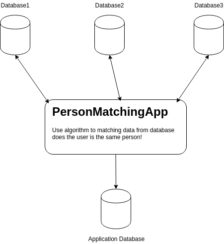

# UserMatching-api
- This project is the part of Service Oriented Programming.


# What is this project about?
This goal of this project is to make service that match the user from diference other database and define the user and activity log
- Match user verification with other email.
- Match user with public data that the user is real person.
- Collect all user information and log in one place.




# The tools that we will use?
- Post Man
- Java SpringBoot api
- Django rest-framework
- My Sql v5.7
- Google Cloud Platform (Sql database)

# (development) Mocked Up Company Data
To access the mocked up data please run the project "companya, companyb"
```
localhost:8200/companya -> Get All Company Customer Mocked Up Data
localhost:8200/companya/id -> Get by Id of Company Customer Mocked Up Data
localhost:8200/companya-create -> Post New Company Customer Mocked Up Data


localhost:8200/companyb -> Get All Company Customer Mocked Up Data
localhost:8200/companyb/id -> Get by Id of Company Customer Mocked Up Data
localhost:8200/companyb-create -> Post New Company Customer Mocked Up Data

Fields of data:
id, username, password, email
id_card_number, fname, lname, address
phone, credit_card,gender
``` 
# Start eureka server
1. เปิด terminal ไปยังโฟลเดอร์ eureka ```docker build -t eureka .```
2. รันคำสั่ง ```docker run -p 8761:8761 eureka``` ให้ทำเริ่มทำงาน

# How to start projects
1. Open terminal and go to directory
2. run command in first terminal ```docker-compose up```
3. run command in second terminal ```docker-compose exec app sh -c "python manage.py runserver 0.0.0.0:8000```

# Eureka Server
The eureka server is run localhost:8761

# Home Service enter firstname, lastname to retrieve data from company. (sop2019)
to start service look below.
1. go to file sop2019 and open project.
2. change ip in ```manage.py, view.py``` to ip that can see in ```localhost:8761``` below.
3. go to ```localhost:8000/person-request/``` and post json data as "first_name, last_name"

# Member and Work Description
We are no.10 group in subject of sevice oreinted programming. 
We manage our work as sub service inside. That's include

- 60070109 -> Make a mock up database service and service to call data from database.
- 60070040 -> Make our service more userfriendly by making front-end side to easy to use.
- 60070106 -> Make service that match the data to confirm how much percent is this real person.
- 60070016 -> Make service that convert data of 2 company to be same type of data.
